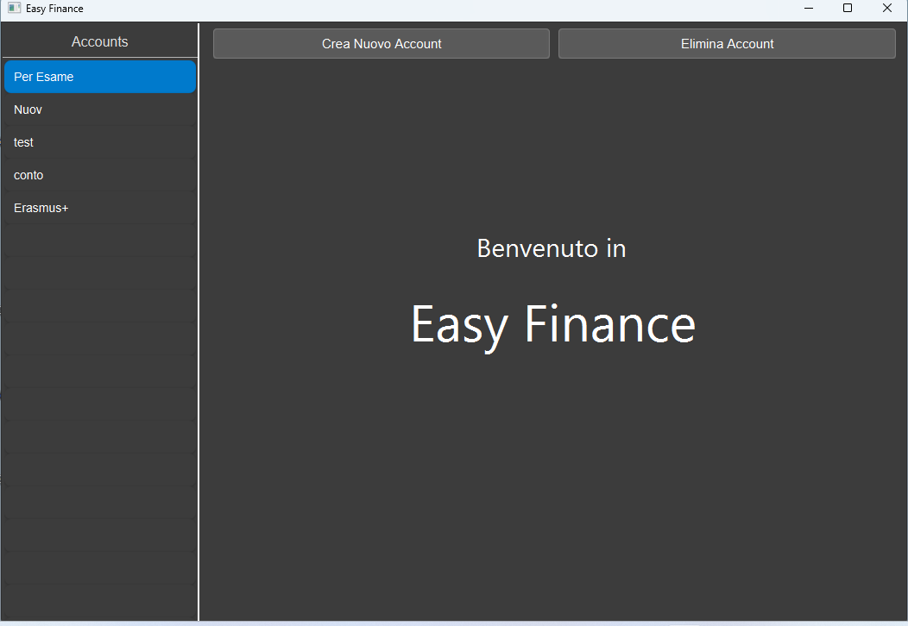
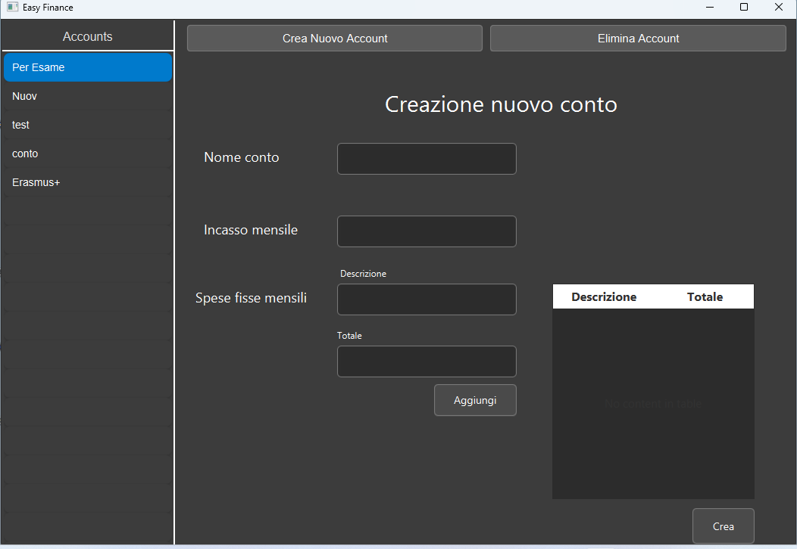

# EasyFinance


Easy Finance è un software scritto in java che permette di gestire i propri conti in modo semplice ed efficace, senza ricadere in intili complicanze. Perciò si tratta di un'applicazione adatta a chi ha bisogno di gestire il denaro ad un livello basilare.

## Struttura DB:
### Diagramma DB:


### Script di Creazione:

```sql
CREATE TABLE IF NOT EXISTS public.account
(
    nomeconto character varying(30) COLLATE pg_catalog."default" NOT NULL,
    monthlyincome double precision,
    bilancio double precision,
    datacreazione date DEFAULT CURRENT_DATE,
    CONSTRAINT account_pkey PRIMARY KEY (nomeconto)
);

CREATE TABLE IF NOT EXISTS public.spesefisse
(
    nomeconto character varying(30) COLLATE pg_catalog."default" NOT NULL,
    descrizione character varying(100) COLLATE pg_catalog."default" NOT NULL,
    amount double precision,
    CONSTRAINT spesefisse_pkey PRIMARY KEY (nomeconto, descrizione)
);

CREATE TABLE IF NOT EXISTS public.spesevariabili
(
    id serial NOT NULL,
    nomeconto character varying(30) COLLATE pg_catalog."default",
    amount double precision,
    gg date,
    descrizione character varying(100) COLLATE pg_catalog."default",
    CONSTRAINT spesevariabili_pkey PRIMARY KEY (id)
);

ALTER TABLE IF EXISTS public.spesefisse
    ADD CONSTRAINT spesefisse_nomeconto_fkey FOREIGN KEY (nomeconto)
    REFERENCES public.account (nomeconto) MATCH SIMPLE
    ON UPDATE CASCADE
    ON DELETE CASCADE;


ALTER TABLE IF EXISTS public.spesevariabili
    ADD CONSTRAINT spesevariabili_nomeconto_fkey FOREIGN KEY (nomeconto)
    REFERENCES public.account (nomeconto) MATCH SIMPLE
    ON UPDATE CASCADE
    ON DELETE CASCADE;
```

## UML

## UI
## Pagina Iniziale

La Pagina iniziale visualizza i conti esistenti sull sinistra, presenta due bottoni per la creazione ed eliminazione di conti, premendo il il tasto destro del mouse su un elemento dlla lista dei conti sarà possibile accedere ad un menù per la modifica di esso.
Le ultime due funzionalità sono la possibilità di premere su "Account" in alto a sinistra per tornare alla pagina iniziale in caso fosse necessario e di premere con il tasto sinistro del mouse su uno degli elemento della lista per accedere alla pagina di utilizzo di un account





## Creazione Nuovo Conto

Da questa pagina è possibile creare un nuovo conto.
Viene richesto di inserire un nome con il quale verrà salvato l'account, un incasso mensile e delle spese fisse, del quale viene richiesta descrizione (univoca) e importo, premendo sulla tabella a sinistra sarà possibile rimuovere le spese fisse inserite





## Elimina Conto

In questa finestra è possibile eliminare un conto già esistente inserendo il suo nome


## Modifica Conto

Nella pagina di modifica del conto è possibile modificare un conto già esistente. in particolare sarà possibile cambiare l' incasso mensile e le spese fisse, le quali influenzeranno alcune azioni e menù nella pagina di utilizzo del conto


## Utilizzo del Conto

Questa pagina presenta diversi elementi:

#### Tabella dei giorni del mese (SX)

Sulla sinistra della pagina è presente un tabella il quale in base al mese ed anno selezionato, mostra i giorni e la somma di tutte le spese effettuate. 
Da questa tabella è possibile visualizzare tutti i giorni/mesi/anni che intercorrono dalla data di creazione del conto alla data corrente.

#### Tabella delle spese giornaliere (DX)

Nel centro della pagina è presente un uterione tabella il quale, premendo su un elemento della tabella di sinistra, permette di visualizzare in detteglio tutte le spese compiute in quella specifica data (gg/mm/aaaa) come riportato sopra. premendo il tasto "aggiungi" è possibile inserire una nuova spese e premendo con il tasto destro del mouse su una delle spese presenti si aprirà un menù a tendina dal quale sarà possibile modificare/eliminare la spesa selezionata.

#### Stipendio/SpeseFisse

Stipendio/SpeseFisse è un pulsante che permette di aggiungere al bilancio l'importo dell' +incassomensile e il -totaleSpeseFisse. La ragione per il quale l'aggiunta di questi importi avviene manualmente è che non è sempre certo stabilire una data precisa nel quale erogare automaticamente stipendio e spese fisse, perciò per una questione di comdità queste verranno inserite nel momento in cui l'utente le riceve in modo manuale.

#### Pulsanti Deposita e Preleva

Come si può immaginare sono pulsanti che permettono di aggiungere e/o prelevare un certo importo dal bilancio, nel caso in cui si ricevano dei soldi in più oltre allo stipendio fisso e per sistemare il bilancio in una fase preliminare in caso di spese precedenti alla creazione del conto.

#### Bilancio totale e giornaliero

Il bilancio totale mostra il bilancio globale del conto allo stato attuale.

Il bilancio giornaliero rappresenta il tuo attuale Risparmio o Debito, cioè basandosi sulla spesa massima giornaliera che puoi affrontare per raggiugnere la fine del mese, mostra il tuo bilancio. Cioè se ad un certo giorno del mese corrente hai speso più soldi (o meno) di quelli che avresti dovuto basandocisi sul tuo stipendio e giorni trascorsi, ti verrà segnalato tramite "il Bilancio Giornaliero".
è calcolato in questo modo:

$`\Bilancio-((Incasso_Mensile-Spese_Fisse)*(1-(Giorno_Corrente/Totale_Giorni_Del_Mese)))`$


