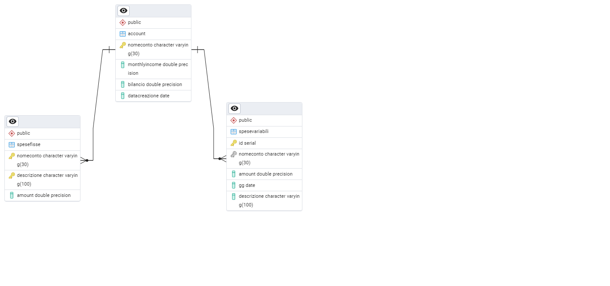
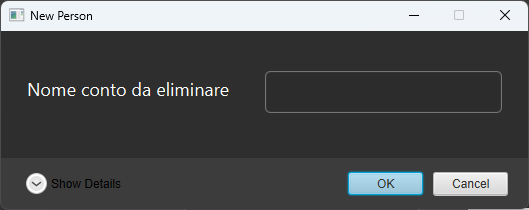
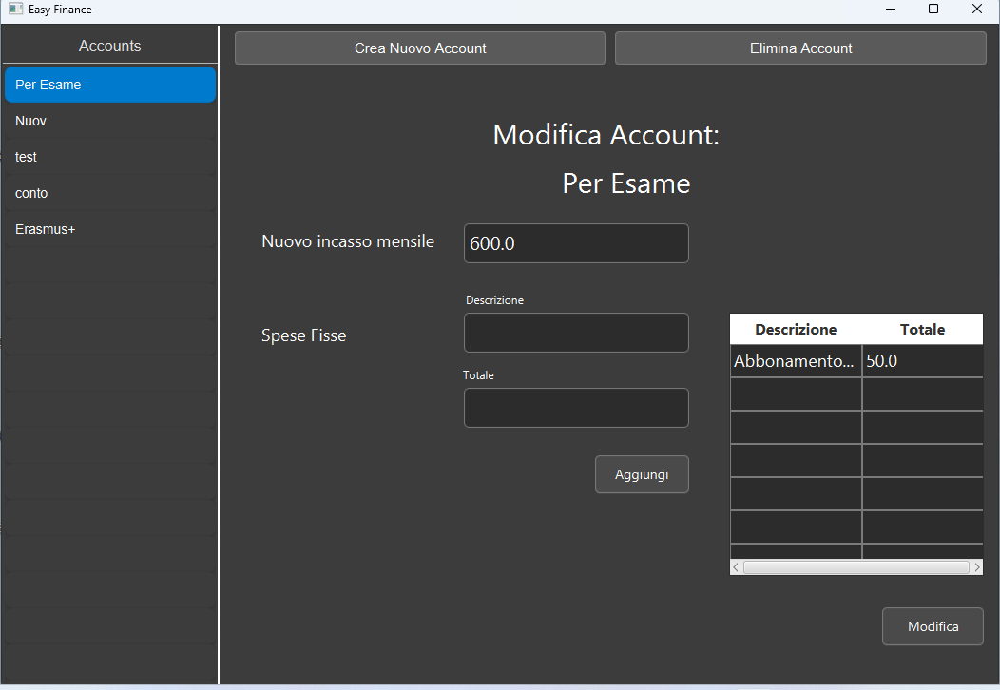
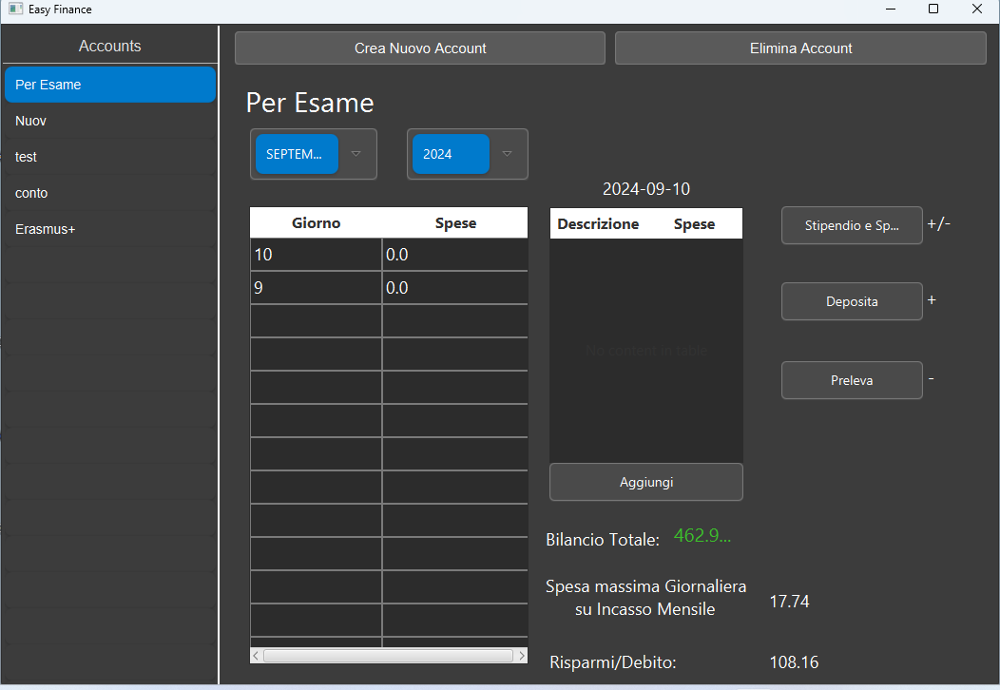

# EasyFinance


Easy Finance è un software scritto in java che permette di gestire i propri conti in modo semplice ed efficace, senza ricadere in intili complicanze. Perciò si tratta di un'applicazione adatta a chi ha bisogno di gestire il denaro ad un livello basilare.

## Struttura DB:
### Diagramma DB:



### Script di Creazione:

```sql
CREATE TABLE IF NOT EXISTS public.account
(
    nomeconto character varying(30) COLLATE pg_catalog."default" NOT NULL,
    monthlyincome double precision,
    bilancio double precision,
    datacreazione date DEFAULT CURRENT_DATE,
    CONSTRAINT account_pkey PRIMARY KEY (nomeconto)
);

CREATE TABLE IF NOT EXISTS public.spesefisse
(
    nomeconto character varying(30) COLLATE pg_catalog."default" NOT NULL,
    descrizione character varying(100) COLLATE pg_catalog."default" NOT NULL,
    amount double precision,
    CONSTRAINT spesefisse_pkey PRIMARY KEY (nomeconto, descrizione)
);

CREATE TABLE IF NOT EXISTS public.spesevariabili
(
    id serial NOT NULL,
    nomeconto character varying(30) COLLATE pg_catalog."default",
    amount double precision,
    gg date,
    descrizione character varying(100) COLLATE pg_catalog."default",
    CONSTRAINT spesevariabili_pkey PRIMARY KEY (id)
);

ALTER TABLE IF EXISTS public.spesefisse
    ADD CONSTRAINT spesefisse_nomeconto_fkey FOREIGN KEY (nomeconto)
    REFERENCES public.account (nomeconto) MATCH SIMPLE
    ON UPDATE CASCADE
    ON DELETE CASCADE;


ALTER TABLE IF EXISTS public.spesevariabili
    ADD CONSTRAINT spesevariabili_nomeconto_fkey FOREIGN KEY (nomeconto)
    REFERENCES public.account (nomeconto) MATCH SIMPLE
    ON UPDATE CASCADE
    ON DELETE CASCADE;
```

## UI
## Pagina Iniziale


## Creazione Nuovo Conto


## Elimina Conto



## Modifica Conto



## Utilizzo del Conto



